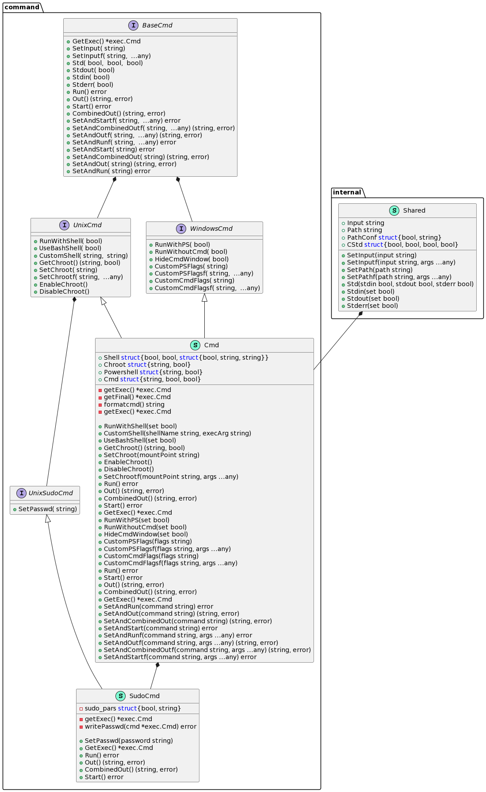

# CmdRunTools

This is a library to execute shell commands (or not) in golang, in unix-like systems using bash or whatever you want and in windows systems, using powershell and cmd.

## Doc

### Structure

Please read the documentation at [here](https://pkg.go.dev/github.com/Tom5521/CmdRunTools)
